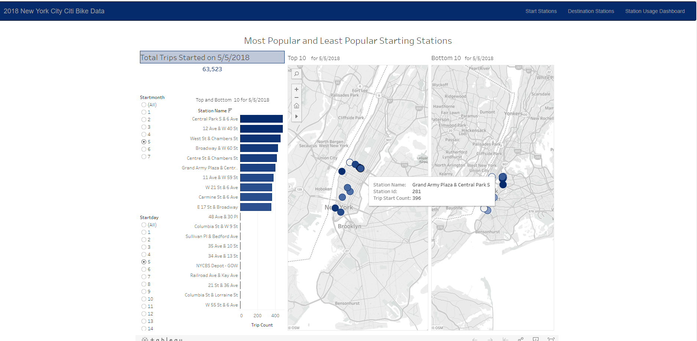
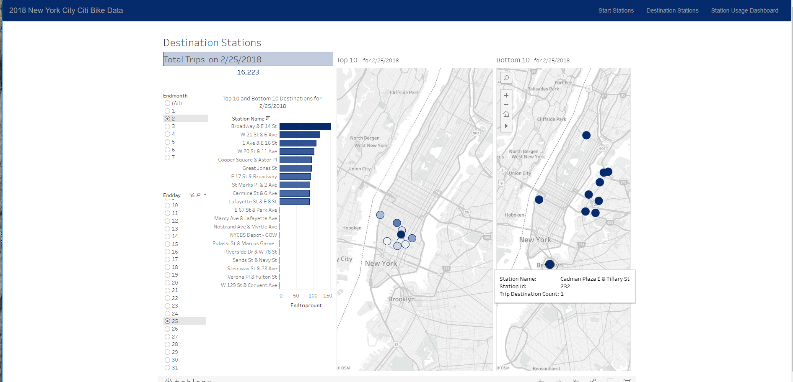

# CitiBike-Tableau
Analysis of the New York City CitiBike Program using Tableau.

Data was downloaded from the [CitiBike Site](https://www.citibikenyc.com/system-data)
cleaned up and prepared using Python in Jupyter Notebooks. The Notebooks used are available on GitHub. Some small amount of cleanup to stations was done 
using Excel. 

Analysis was done in Tableau Public. The size of the data required multiple workbooks so they have been made available here by embedding the workbooks in html.

[Citibike Analysis](https://blizzardfun.github.io/CitiBike-Tableau/)

There are 4 views. 

The station story shows Citibike station usage for both the starting station of a trip and the ending station plotted on a map. There are maps for 3 separate months plus a cumulative of the 3 months. Station usage level is indicated both as a color difference (foreground blue = Start, background pink = End)  and in a tool tip.

The start station view shows the top 10 and also the bottom 10 most/least used stations for starting a trip on the date selected. These stations are shown as both a list and a map. 

The destination station view is the same as the start station view except for the destination station of a trip.

The usage dash shows various usage levels for both January and July for a selected station. The usage levels include hourly usage, and a break down by gender and usertype. The hourly usage graph shows interesting variation from station to station and invites further analysis of the surroundings for each station. 
           

